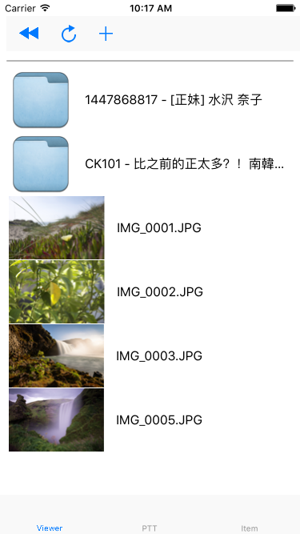

PhotoViewer 看圖小幫手
======================
 

看圖小幫手，是一個實驗性質的App．主要是把[我愛批踢踢](https://github.com/kkdai/iloveptt)，[我愛卡提諾](https://github.com/kkdai/iloveck101)與[臉書相簿小幫手](https://github.com/kkdai/goFBPages) 整合進iOS的App，透過[Gomobile](https://godoc.org/golang.org/x/mobile/cmd/gomobile)

主要的核心模組為[PhotoMgr](https://github.com/kkdai/photomgr) 是由Go撰寫的．其他相關的功能也都會寫在核心模組上．

截圖
--------------

瀏覽與管理相片的介面

瀏覽Ptt 與下載的介面

使用方式，透過[上頁]與[下頁]的切換．看到喜歡的文章點選下去，會自動把圖片下載到手機裡面．可以透過瀏覽介面來看．

未來規劃
---------------

由於我主要在忙我的[project 52](https://github.com/kkdai/project52) 這個專案會不定期更新，未來規劃請看[PhotoMgr](https://github.com/kkdai/photomgr)

廣告
---------------

如果你喜歡這個App，請花30塊買小弟的[粉絲相簿](https://itunes.apple.com/tw/app/fen-si-xiang-bu/id839324997?l=zh&mt=8) App．感謝...

Project52
---------------

It is one of my [project 52](https://github.com/kkdai/project52).

License
---------------

This package is licensed under MIT license. See LICENSE for details.
